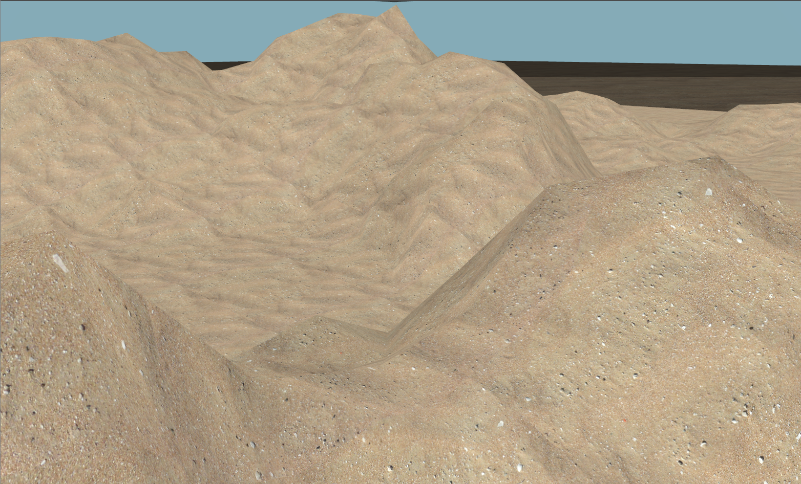
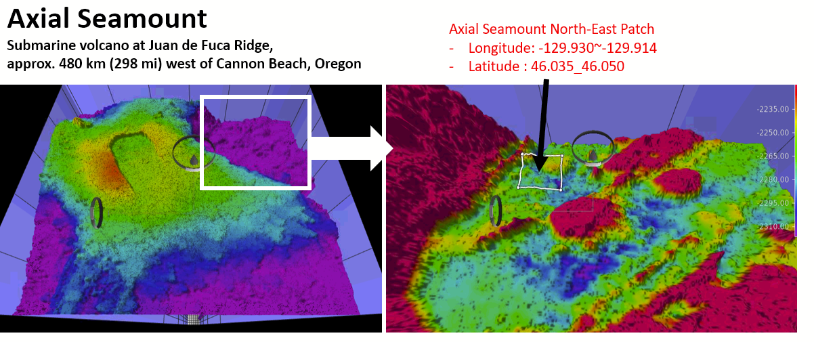
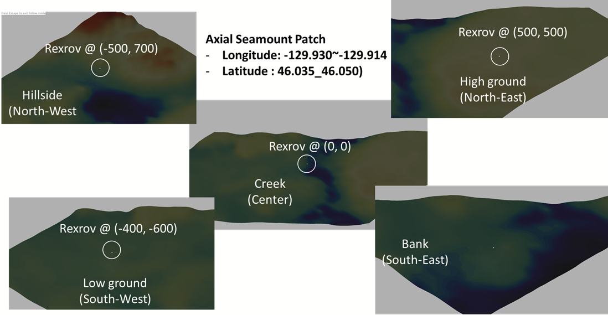
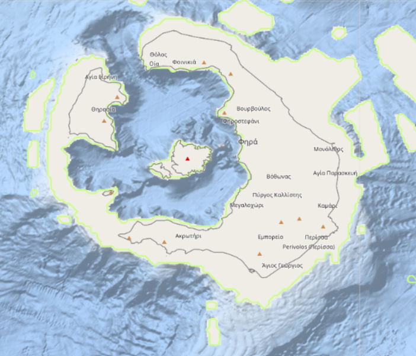
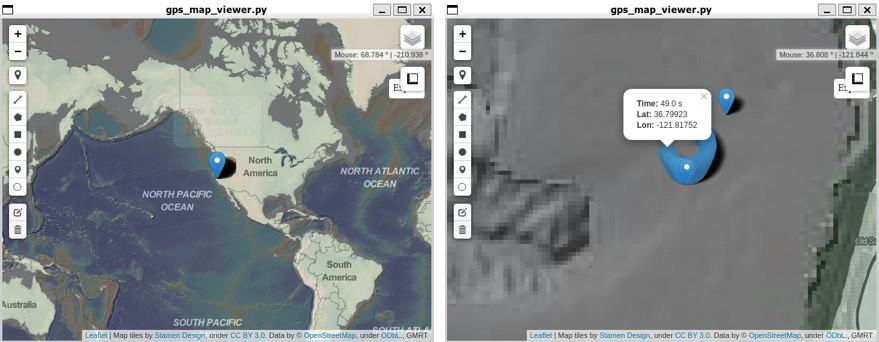

# Contents

<!-- TOC generated with https://github.com/ekalinin/github-markdown-toc -->
<!--
 cat bathymetry_plugin.md | ./gh-md-toc -
-->

* [Sand Heightmap (from UUV Simulator)](#Sand-Heightmap)
* [Axial Seamount](#Axial-Seamount)
* [Santorini](#Santorini)
* [Monterey Bay (Downloadable)](#Monterey-Bay)

# Overview

There's two different methods to include heightmap in the Gazebo Classic. One is to use a generic Ogre's heightmap generation feature included in the Gazebo Classic which can be found [here](http://gazebosim.org/tutorials/?tut=dem). The other is to dissect and generate one or many tiles of bathymetry patches from large bathymetry heightmap files by using the [Bathymetry_Converter](https://github.com/Field-Robotics-Lab/Bathymetry_Converter). User may choose whichever they like. But the former (at current date, 2022/02/22, is found to have bug not being able to remove and insert new bathymetry on the fly). Also, the Ogre's feature takes much longer to load the bathymetry into the scene. The latter, can be used with [Bathymetry auto spawning/removing plugin](https://github.com/Field-Robotics-Lab/dave/wiki/Bathymetry-Integration) which inserts and removes bathymetry tiles acoording to the vehicles' location as needed.

# Sand Heightmap

Sand heightmap is a novel heightmap for test and evaluation purposes in the small area. It includes flat regions and relatively high peaks in small area which is often unavailable in real bathymetry dataset. It also includes sand material texture to make it look realistic.

The first dave_demo.launch you will be trying out after the installation includes the Sand Heightmap.

```bash
roslaunch dave_demo_launch dave_demo.launch
```




# Axial Seamount

Axial seamount is a submarine volcano at Juan de Fuca Ridge which is approximately 480 km (298 mi) west of Cannon Beach, Oregon. It's generated using the [Bathymetry_Converter](https://github.com/Field-Robotics-Lab/Bathymetry_Converter) with a single tile to cover the entire patch region; single tile. The color texture is applied according to its relative depth.

```bash
roslaunch dave_demo_launch dave_Axial_Seamount_demo.launch
```





### Related files
- world file : `dave_Axial_Seamount.world`
- launch file : `dave_Axial_Seamount_demo.launch`
- Model : `dave/models/dave_object_models/models/AxialSeamountPatch`

### Statistics
- Origin of the source data : https://www.marine-geo.org/tools/datasets/30219
    Clague, D.; Caress, D. and J. Paduan, (2022). Preliminary 1-meter resolution
    bathymetric model (ESRI ASCII grids) for the summit region of Axial
    Seamount, version as of 10 March 2021. IEDA. doi:10.26022/IEDA/330219
- Resolution : 75 cm
- Latitude : 46.035 ~ 46.05
- Longitude : -129.93 ~ -129.914
- Size of the patch : (Lat, Lon) = (0.015, 0.016) = Approx 1000 x 1000 meters
- Maximum Height : -2139.0134277
- Minimum height : -3.4E+38 (garbage data inside)
- Number of vertices of original data = 3072 x 2560

### Conversion method
- `mkbaty.py` automation script at https://github.com/Field-Robotics-Lab/Bathymetry_Converter
- Flags parameters used inside the script :
   - `ONE_TILE_AT_ORIGIN` : True
   - `SIMPLIFICATION_LEVEL` : 3 ( if set 0; without any simplification, the mesh OBJ would be 350MB~)
      - Size of the OBJ file is 25 MB
- Parameters used:
    - `PREFIX` = AxialSeamountPatch
    - Ranges
       - `STARTLON` = -129.930
       - `STARTLAT` = 46.035
       - `ENDLON` = -129.914
       - `ENDLAT` = 46.050
    - Color texture (`color.txt`)

       ```
       -2190 213 62 79
       -2210 244 109 67
       -2230 254 224 139
       -2245 255 255 191
       -2260 230 245 152
       -2275 171 221 164
       -2290 102 194 165
       -2295 50 136 189
       -2300 94 79 162
       -2315 77 77 77
       -2330 26 26 26
       ```

### (Optional) Tile version

- On `axial_seamount_tiles` branch at https://github.com/woensug-choi/dave/tree/axial_seamount_tiles
- Size of each tile : (Lat, Lon) = (0.005, 0.005) = Approx 350 x 350 meters
- Tiles to keep on the scene  = 3 tiles
- **GIF animation (click image to see the animated GIF)**


# Santorini

Yes, the Santorini as we know. One of the Cyclades islands in the Aegean Sea. This bathymetry was particularily interesting because it includes high regions and relatively flat floor in a small area. The color texture is applied according to its relative depth.


```bash
roslaunch dave_demo_launch dave_Santorini_demo.launch
python3 dave/examples/dave_nodes/src/merry_go_round.py
```



- **GIF animation (click image to see the animated GIF)**


### Related files
- world file : `dave_Santorini.world`
- launch file : `dave_Santorini_demo.launch`
- Model : `dave/models/dave_object_models/models/Santorini`
- Merry-go-round-script `dave/examples/dave_nodes/src/merry-go-round.py`


### Statistics
- Origin of the source data : EMODnet Bathymetry Consortium (2020): EMODnet Digital Bathymetry (DTM).
   https://sextant.ifremer.fr/record/bb6a87dd-e579-4036-abe1-e649cea9881a/
- Resolution : 75 cm
- Latitude : 36.337 ~ 36.479
- Longitude : 25.317 ~ 25.489
- Size of the patch : (Lat, Lon) = (0.015, 0.014) = Approx 1000 x 1000 meters
- Maximum Height : 554.95 m (land)
- Minimum height : -453.93 m
- Number of vertices of original data = 350 x 291


### Conversion method
- `mkbaty.py` automation script at https://github.com/Field-Robotics-Lab/Bathymetry_Converter
- Unlike the axial seamount case, it needed some manual manipulation of the source data
   - because the XYZ in the GeoTiff was not equally-spaced. It had to be interpolated using `gdal_grid`
- Flags parameters used inside the script :
   - `ONE_TILE_AT_ORIGIN` : True
   - `SIMPLIFICATION_LEVEL` : 0
      - Size of the OBJ file is 18.9 MB
- Parameters used:
    - `PREFIX` = Santorini
    - Ranges
       - `STARTLON` = 25.317
       - `STARTLAT` = 36.337
       - `ENDLON` = 25.489
       - `ENDLAT` = 36.479
    - Color texture (`color.txt`)

       ```
      100 213 62 79
      50 244 109 67
      0 254 224 139
      -50 255 255 191
      -150 230 245 152
      -200 171 221 164
      -250 102 194 165
      -300 50 136 189
      -350 94 79 162
      -400 77 77 77
      -450 26 26 26
       ```


# Monterey Bay

At [Bathymetry_Integration](Bathymetry-Integration) tutorial, the Monterey Bay area is included in the downloading file.


