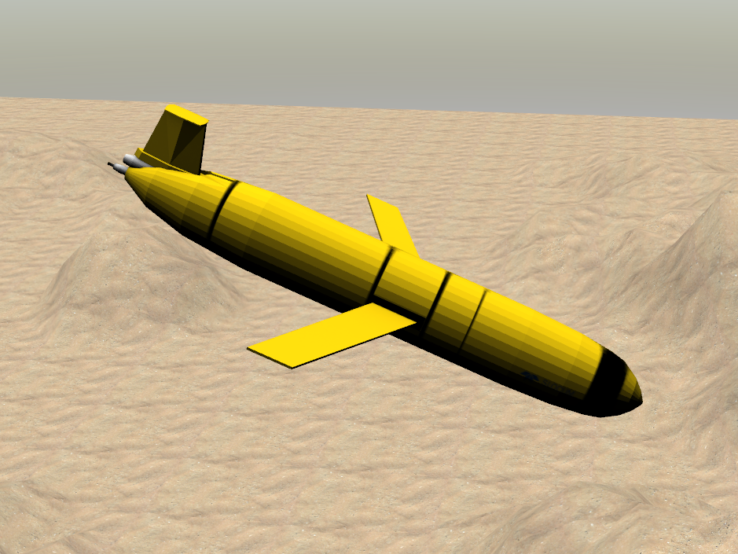
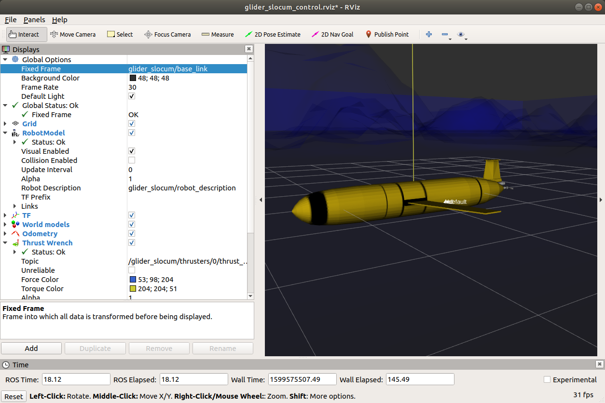
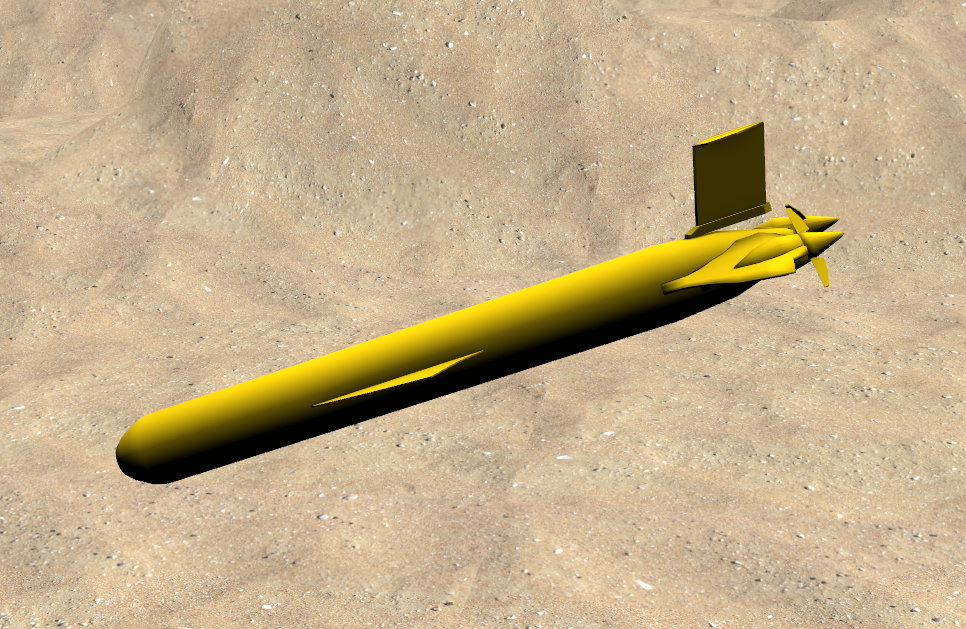
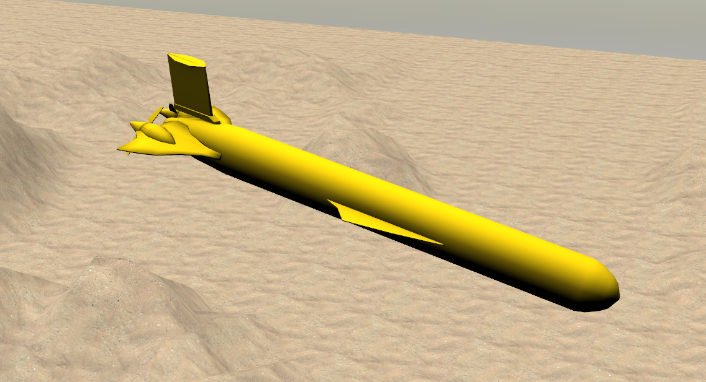
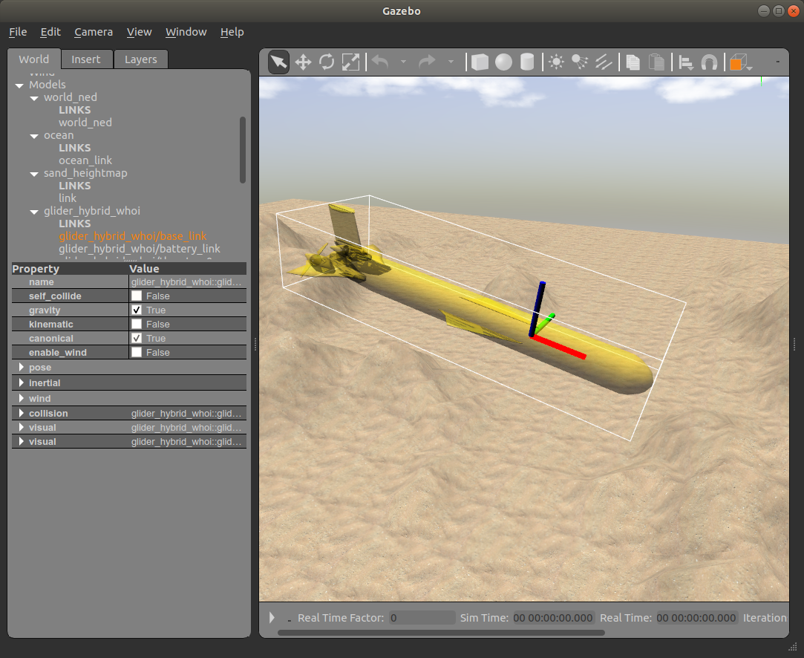
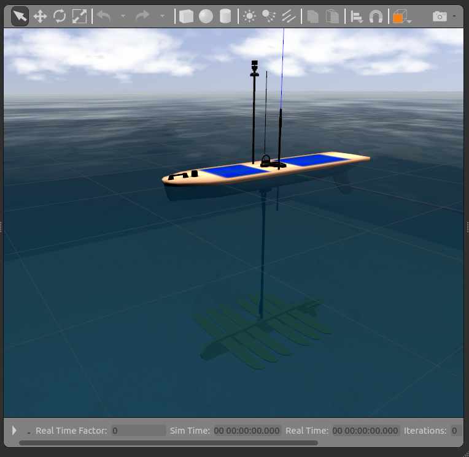

# Static examples to illustrate visual models

## Underwater gliders

The following launch file starts the ocean world and adds each of the three gliders: Slocum, hybrid and wave.

```
roslaunch dave_demo_launch dave_gliders_visual_demo.launch paused:=true
```
To see each glider, expand the `Models` on the left side panel of the Gazebo window and right click the glider name and click `Move To`


This command launches an example ocean floor and loads three gliders into the simulation world in the Gazebo. It is meant to launch with a `paused` flag since the hydrodynamics of the wave glider is not developed yet. It's mainly to demonstrate the visual of the three gliders.

If you want to try the newly developed physics engine of the glider dynamics, please visit https://github.com/Field-Robotics-Lab/glider_hybrid_whoi

### Slocum glider






### WHOI hybrid glider








## Wave glider




