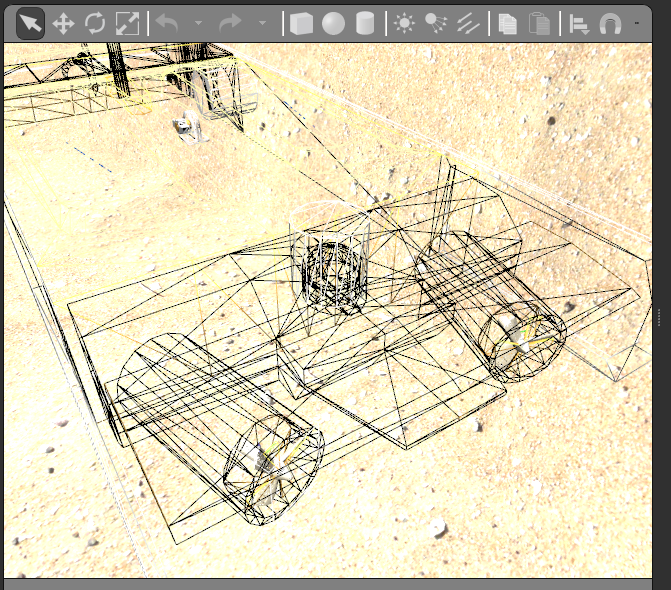

# Creating and Integrating a New U/W Vehicle

In this example we will integrate a new robot with the name `smilodon`.

## Import visual and collision mesh files into proejct.

Assumes we start with visual/collision meshes and texture image files.

1. Create a new ROS project: `smilodon_gazebo`, add a `meshes` directory and copy the mesh files and image file.
2. May be necessary to edit the visual mesh file to link to the correct texture filename.  Simply search for image in the .dae file and replace as necessary.
3. Check the visual mesh by importing the mesh using blender and/or meshlab.

## Launch a world, spawn the robot from URDF

### Create launch file

Create `smilodon_gazebo/launch/smilodon.launch` to do the following...

1. Start gazebo with an underwater world.
2. Load the robot URDF (see next step) to the parameter server
3. Spawn the robot in the world
4. Start `robot_state_publisher` node

### Create robot URDF

In `smilodon_gazebo/urdf` create `smilodon_gazebo.xacro` to do the following...

1. Create `base_link` with the rigid-body parameters and the visual/collision meshes
2. Attach the `uuv_underwater_object_ros_plugin` and specify the hydrodynamic parameters.
3. Attach a `gazebo_ros_control` plugin.
4. Attache a custom `uuv_joint_state_publisher`


Note: It is sometimes handy during testing to set `<neutrally_buoyant>1</neutrally_buoyant>` within the parameters for the `uuv_underwater_object_ros_plugin`.

### Test

```
roslaunch smilodon_gazebo smilodon.launch
```


## Add propulsion

### Add thruster propellers, joints and plugins

Edit `smilodon_gazebo/urdf/smilodon_gazebo.xacro` to add thruster definition macros.
1. Define location of the propellors - can superimpose on vehicle mesh
2. Set the motor constant to map the command (input) to thrust.
3. User the [thruster_snippets.xacro](https://github.com/uuvsimulator/uuv_simulator/blob/master/uuv_gazebo_plugins/uuv_gazebo_ros_plugins/urdf/thruster_snippets.xacro) definitions which make use of the [ThrusterROSPlugin](https://github.com/uuvsimulator/uuv_simulator/blob/master/uuv_gazebo_plugins/uuv_gazebo_ros_plugins/src/ThrusterROSPlugin.cc)



### Test by publishing thruster input.

Here is a [video](https://vimeo.com/456816343) of spinning the props.

Illustrates publishing a thruster input
```
rostopic pub /smilodon/thrusters/0/input uuv_gazebo_ros_plugins_msgs/FloatStamped "header:
  seq: 0
  stamp:
    secs: 0
    nsecs: 0
  frame_id: ''
data: -200.0"
```

and monitoring the resulting thrust

```
rostopic echo /smilodon/thrusters/0/thrust
```

### Test with joystick

The custom `joy_thrusterop.py` has a hardcoded mapping from joystick axes to each thruster.  This allows us to drive the vehicle in an open-loop configuration.

Run the telop with

```
roslaunch uuv_dave joy_thrusterop.launch
```

Here is [another video](https://vimeo.com/456834448) showing what to expect.

To try with other existing vehicles, check [here](dave_models/vehicle_examples)