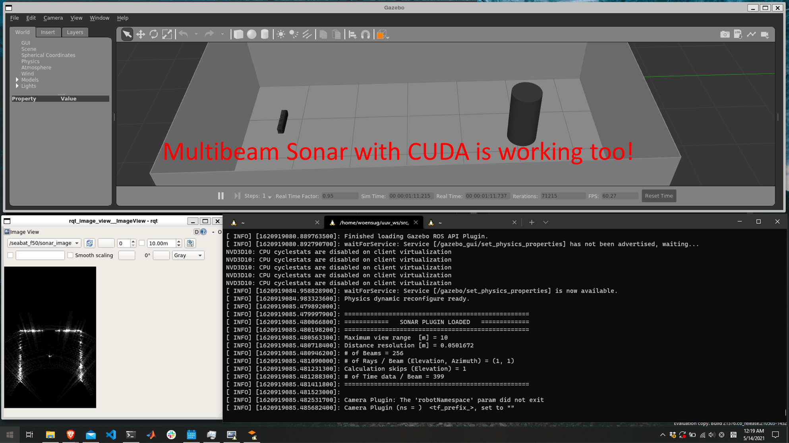

# Enroll in Windows Insider Program (Dev channel) and install WSL2 at Windows

(2021/7/30)
Currently, the `beta` channel includes updates what is needed here. the beta channel of windows 10 will be installing Windows 11. For some old hardware, windows 11 cannot be installed ([Windows 11 requirement checker](https://github.com/rcmaehl/WhyNotWin11/releases/latest/download/WhyNotWin11.exe)).

You need a discrete GPU and 16GB or more of memory to run things smoothly.

## Check windows version

MS Developers are working to integrate Linux into Windows day by day. The milestone release to run the Dave project at Windows platform using WSL2 is at Windows 10 build 21364 which finally includes GUI support for Linux applications along with GPU accelerations. [Link to official MS blog](https://devblogs.microsoft.com/commandline/the-initial-preview-of-gui-app-support-is-now-available-for-the-windows-subsystem-for-linux-2/)

In order to install Windows 10 build 21364 or higher, you have to enroll in Windows Insider Program and do windows update to obtain the right version of windows. Currently (July 30, 2021), The windows 10 build 21364 is only available for those who enrolled in the Beta Channel of the Windows Insider Program. It's not a stable version but as time goes, it will come down to an official update in order. Dev Channel (edge) -> Beta Channel (More stable) -> Pre-release Channel -> Public release.

run Win Logo + R and type 'winver' to check if windows version is above Build 21364. Otherwise, enroll Windows Insider Program and run windows update.

## Install WSL 2 with Ubuntu 20.04 LTS

[https://docs.microsoft.com/en-us/windows/wsl/install-win10](https://docs.microsoft.com/en-us/windows/wsl/install-win10)

If you already have WSL installed, all you need to do is run wsl --update and you’ll be set to use GUI apps.

Recommend using [Windows Terminal](https://www.microsoft.com/ko-kr/p/windows-terminal/9n0dx20hk701?rtc=1) to access Ubuntu in WSL2.

## Graphics driver for WSL

README for WSL OpenGL Support : https://github.com/microsoft/wslg

- [NVIDIA GPU driver for WSL](https://developer.nvidia.com/cuda/wsl)
- [INTEL GPU driver for WSL](https://downloadcenter.intel.com/download/30579/Intel-Graphics-Windows-DCH-Drivers)
- [AMD GPU driver for WSL](https://community.amd.com/t5/radeon-pro-graphics-blog/announcing-amd-support-for-gpu-accelerated-machine-learning/ba-p/414185)


## Install Dave project
Thanks to the great design of WSL2 system architecture. Just follow ordinary instruction

**Linux Host** [Configure Your Host Machine](/dave/contents/installation/Install-Directly-on-Host): Instructions to install ROS Noetic, Gazebo 11, UUV Simulator and DAVE directly on your Ubuntu 20.04 host machine.

- You may be tempted to git clone repositories at windows hosted directories (e.g. /mnt/c/users). DO NOT. it's painfully slow compared to accessing data inside the local folder (e.g. /home/$USER).

## Notes: For Multibeam sonar CUDA Library
Follow https://docs.nvidia.com/cuda/wsl-user-guide/index.html to install CUDA library inside WSL

try `nvcc` for installation verification. If not working, add these paths exports at ~/.bashrc
```
export PATH=/usr/local/cuda/bin${PATH:+:${PATH}}
export LD_LIBRARY_PATH=/usr/local/cuda/lib64${LD_LIBRARY_PATH:+:${LD_LIBRARY_PATH}}
```

## If you see slow fps,
It's possible that your discrete GPU is not loaded in the WSL.
try run
```bash
sudo apt install mesa-utils
glxinfo | grep OpenGL
```
If you don't see your GPU name at the output, try this
```bash
sudo add-apt-repository ppa:kisak/kisak-mesa
sudo apt-get update && sudo apt dist-upgrade
```
And again, `glxinfo | grep OpenGL`. What you should see is something like this,
```bash
OpenGL vendor string: Microsoft Corporation
OpenGL renderer string: D3D12 (NVIDIA GeForce GTX 1660 Ti)
OpenGL core profile version string: 3.3 (Core Profile) Mesa 21.0.3 - kisak-mesa PPA
```
Reference : https://github.com/microsoft/wslg/issues/86


## Screenshot : Almost 60 fps, comparable to direct Linux host installation



