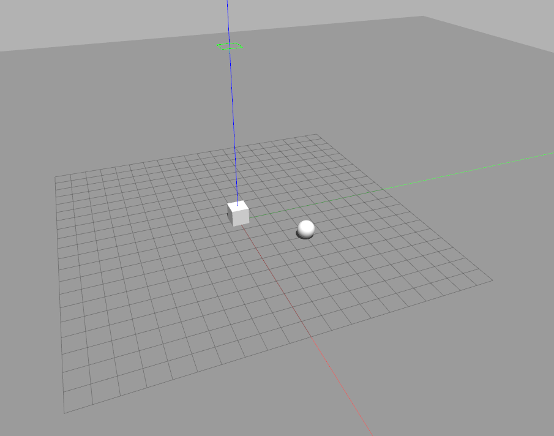
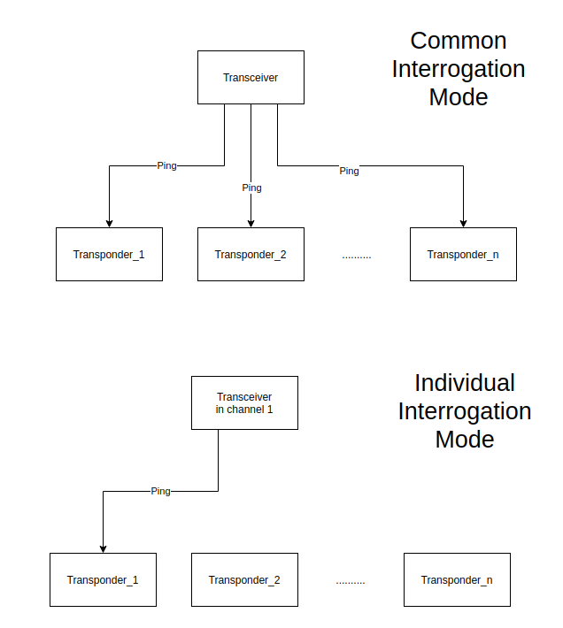
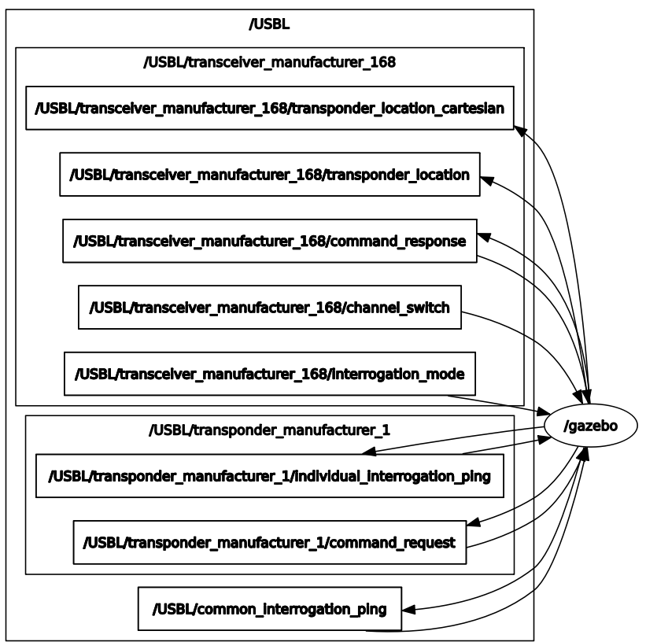

# Ultra Short Baseline (USBL) Gazebo Plugin Tutorial

USBL is used to assist underwater navigation and positioning. It consists of one transceiver and one or multiple transponders (or beacons). Usually, the transceiver will be attached to either a stationary object or mobile central node, whereas the transponder(s) is attached to objects that are being tracked. For more information, see [this] video (best explanation I have seen so far).
<br>
<br>

### Quick Start
Once the catkin environment is sourced, one can launch the tutorial world by the following command:
```
roslaunch usbl_gazebo tutorial.launch
```
Gazebo will be launch and one may see the following scene



In this tutorial, the box acts as transceiver, whereas the sphere acts as transponder.

Upon the world creation, the following ROS topics will be created:
```
/USBL/common_interrogation_ping
/USBL/transceiver_manufacturer_168/channel_switch
/USBL/transceiver_manufacturer_168/command_response
/USBL/transceiver_manufacturer_168/interrogation_mode
/USBL/transceiver_manufacturer_168/transponder_location
/USBL/transceiver_manufacturer_168/transponder_location_cartesian
/USBL/transponder_manufacturer_1/command_request
/USBL/transponder_manufacturer_1/individual_interrogation_ping
```

One can echo the position of the transponder as reported by the transceiver
```
rostopic echo /USBL/transceiver_manufacturer_168/transponder_location
```
OR
```
rostopic echo /USBL/transceiver_manufacturer_168/transponder_location_cartesian
```

If a faster ping rate is desired, one can decrease the value of the `<ping_freq>` tag in the `tutorial.world` file.

The message type used in representing the coordinates is in `geometry_msgs/Vector3`. To avoid confusion, the following table provides some clarities Vector3 interpretation in each coordinate system:
| Vector3 msg fields | Spherical coordinates | Cartesian coordinates |
| ------   | ------  |------ |
| x | Bearing | X
| y | Range | Y
| z | Elevation | Z |

<br>
<br>

### How does USBL Gazebo Plugin work
There are at least two entities involved in USBL operation, one transceiver and one or more trasnponders. In Gazebo simulation environment, all transponders deployed will subscribe to `common_interrogation_ping` and their corresponding `individual_interrogation_ping`. The overall communication is described in the following picture:



A ping signal can be sent by publishing a string message with data field `ping` to either `common_interrogation_ping` topic or `individual_interrogation_ping` topic (depending on transceiver's communication channel). If the intention is to gather position for all transponders, `common_interrogation_ping` is a more appropriate topic choice.

If the user wants to ping a particular transponder, individual interrogation mode must be used. To switch to individual interrogation mode, one can publish string msg to `interrogation_mode` topic. For example,

```
rostopic pub --once /USBL/transceiver_manufacturer_168/interrogation_mode std_msgs/String "data: 'individual'"
```

Currently, only `common` and `individual` mode are supported. The channel on the transceiver must match the transponder ID. To switch channel on the transceiver, one can simply publish a string message with data `<tranponderID>` to `channel_switch` topic at the transceiver side. For example,

```
rostopic pub --once /USBL/transceiver_manufacturer_168/channel_switch std_msgs/String "data: '1'"
```

Then publish a message to `individual_interrogatoin_ping` topic of the target transponder.
```
rostopic pub --once /USBL/transponder_manufacturer_1/individual_interrogation_ping std_msgs/String "data: 'hello world'"
```

The overview of the ros node communication is depicted below:



<br>
<br>

### Parameters of the Plugins
In tutorial.world file, a world is created with two models: a box at the center and a sphere at (3, 3), as one may see in the scene at the beginning of the tutorial. Because both plugins are currently model plugin, they should be placed within the model block. In the case of the transceiver plugin, one may see the following inside the box model in the tutorial.world file.

```
<plugin name="usbl_transceiver" filename="libtransceiverPlugin.so">
    <namespace>USBL</namespace>
    <transponder_device>trasnponder_manufacturer</transponder_device>
    <transponder_ID>1</transponder_ID>
    <transceiver_device>tranceiver_manufacturer</transceiver_device>
    <transceiver_ID>168</transceiver_ID>
    <enable_ping_scheduler>false</enable_ping_scheduler>
    <transponder_attached_object>sphere</transponder_attached_object>
    <interrogation_mode>common</interrogation_mode>
    <sound_speed>1540.0</sound_speed>
    <ping_freq>2</ping_freq>
</plugin>
```
The following table explains what each tag in USBL transceiver plugin means. Most of the tags are required to load the plugin properly, while optional tags will be otherwise mentioned in the Notes column. Same requirement is also applied to USBL transponder plugin.
| Tag name | Meaning | Notes |
| ------   | ------  |------ |
| namespace | USBL namespace |
| transponder_device | Transponder model | can be manufactuerer or vendor name
| transponder_ID | Unique trasnponder ID | can be multiple IDs separated with comma |
| transceiver_device | Transceiver model | can be manufactuerer or vendor name
| transceiver_ID | Unique transceiver ID |
| transponder_attached_object| Gazebo model that transponder attaches to |
| interrogation_mode | Determines how transceiver sends ping to transponder | Optional, choose between common (default) or individual
| sound_speed| speed of the sound in ocean | default is 1540.4 m/s
| ping_freq | The frequency of sending pings | default is 1Hz with common interrogation mode

<br>

In the case of the transponder (inside the sphere block in tutorial.world):
```
<plugin name="usbl_transponder" filename="libtransponderPlugin.so">
    <namespace>USBL</namespace>
    <transponder_device>trasnponder_manufacturer</transponder_device>
    <transponder_ID>1</transponder_ID>
    <transceiver_device>tranceiver_manufacturer</transceiver_device>
    <transceiver_ID>168</transceiver_ID>
    <sound_speed>1540.0</sound_speed>
    <mu>0</mu>
    <sigma>0.0</sigma>
</plugin>
```
The following table explains what each tag in USBL transponder plugin means.
| Tag name | Meaning | Notes |
| ------   | ------  |------ |
| namespace | USBL namespace |
| transponder_device |Ttransponder model | Can be manufactuerer or vendor name
| transponder_ID | Unique trasnponder ID | Single ID |
| transceiver_device | Transceiver model | Can be manufactuerer or vendor name
| transceiver_ID | Unique transceiver ID |
| sound_speed| speed of the sound in ocean | default is 1540.4 m/s
| mu | mean of noise  | Optional, default is 0.0
| sigma| standard deviation of noise | Optional, default is 1.0

<br>

Note: If one wants to get exact location of the transponder(s), `mu` and `sigma` should be zero.

[this]: <https://www.youtube.com/watch?v=ZYTqp2thhZA&ab_channel=Sonardyne>